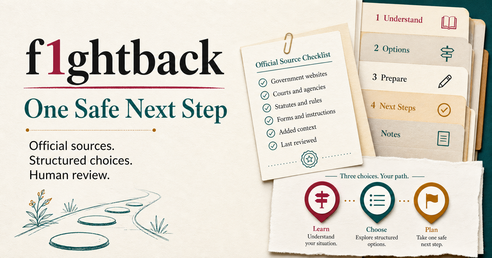
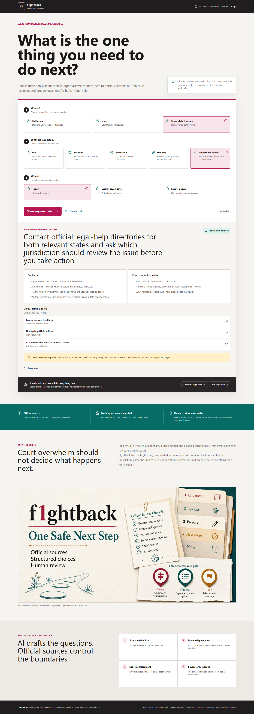
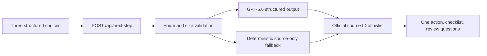

# f1ghtback: One Safe Next Step



f1ghtback is a source-grounded legal-information guide for people facing family-court overwhelm. Choose a jurisdiction, a practical need, and a timing window. The app returns one contained next action, a short checklist, questions for human legal help, and links from an official allowlist.

Built by Faith Atwater-Cheltenham, a Black mother and disabled technologist, from lived experience navigating family court.

## Build Week Entry

- Category: Apps for Your Life
- Runtime: OpenAI Sites / Cloudflare Workers
- AI: GPT-5.6 Responses API with structured output
- Core guarantee: deterministic source-only output remains available when AI is unavailable
- Data posture: no account, free-text case narrative, document upload, seeded record, or personal-data storage

## Try It

Live app: https://f1ghtback-one-safe-next-step.indigo-iris-5804.chatgpt.site

1. Choose California, Utah, or Cross-state / unsure.
2. Choose File, Respond, Protection, Get help, or Prepare for review.
3. Choose Today, Within seven days, or Later / unsure.
4. Review one next action, a checklist, human-review questions, and official sources.

No sample data is needed. The interface accepts only structured, non-personal selections.



Mobile QA capture: [docs/assets/product-mobile.png](docs/assets/product-mobile.png)

## Local Setup

Requirements: Node.js 22.13 or newer and npm.

```powershell
npm ci
npm run dev
```

Open the local URL printed by vinext.

GPT-5.6 is optional for local development. Set `OPENAI_API_KEY` in an ignored local environment only. Without it, the application returns a labeled source-only result.

## Verification

```powershell
npm test
npm run lint
```

The tests cover rendered HTML, structured-input validation, jurisdiction isolation, cross-state holds, allowlisted sources, AI failure, and source-only fallback.

## Architecture



Only curated source metadata enters the model prompt. Model-produced URLs are never rendered. Returned source IDs must match the application allowlist.

## Legal And Privacy Boundary

This application provides legal information and preparation support. It does not provide legal advice, select forms for cross-state matters, calculate deadlines, file or serve documents, contact another person, or create an attorney-client relationship.

The public edition excludes evidence, transcripts, child information, case timelines, private strategy, credentials, `.fayth` files, desktop storage, private screenshots, and fundraising systems.

## Codex And GPT-5.6

Codex was used to isolate a public-safe product from a larger private desktop system, build the structured workflow, enforce jurisdiction and privacy boundaries, implement tests, run visual QA, and prepare the Sites and GitHub releases. GPT-5.6 is used at runtime only to organize bounded legal-information questions from enumerated inputs. Official source controls and the deterministic fallback remain above model output.

## License

Code is licensed under Apache-2.0. The f1ghtback name, marks, founder story, and non-code brand assets are not granted under that license. See `TRADEMARKS.md`.
