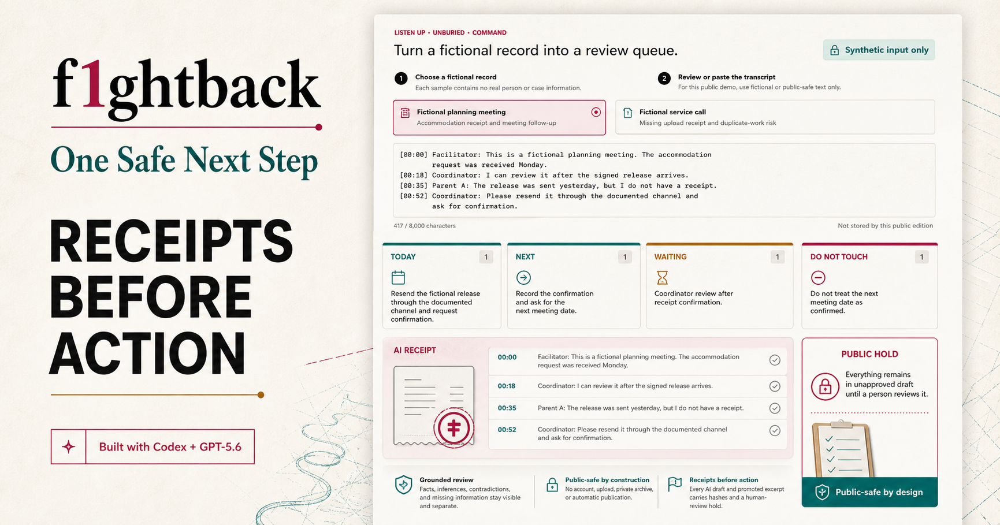
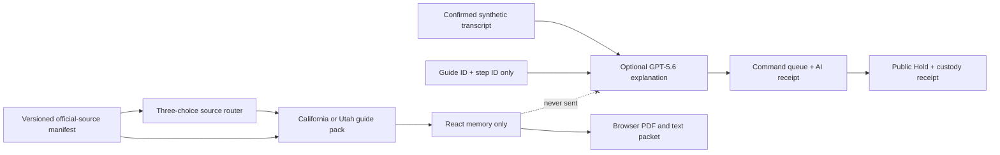

# f1ghtback: One Safe Next Step



f1ghtback turns a fictional public-safe record into a reviewable command queue, then helps self-represented people choose an official-source route and prepare a draft court-response packet while keeping their own words on their device.

Built by Faith Atwater-Cheltenham, a Black mother and disabled technologist, from lived experience navigating family court.

## Build Week Entry

- Category: **Apps for Your Life**
- Runtime: OpenAI Sites / Cloudflare Workers
- AI: GPT-5.6 synthetic-record analysis plus optional answer-free step explanations, both with strict structured output
- Core guarantee: the record demo accepts fictional public-safe text only; personal preparation answers remain in browser memory and never enter Sites, D1, GPT, analytics, or persistent browser storage
- Live app: https://f1ghtback-one-safe-next-step.indigo-iris-5804.chatgpt.site

Big Stick existed before Build Week as a private local desktop suite. This repository is the separate public-safe contest app. No private desktop source, record, evidence, transcript, credential, or case strategy is included.

## What It Does

1. Analyzes one of two synthetic transcripts into `Today / Next / Waiting / Do Not Touch`, facts, inferences, contradictions, and missing information.
2. Produces visible AI and evidence-promotion receipts with source/excerpt SHA-256 hashes and a non-negotiable Public Hold.
3. Routes California, Utah, and cross-state or uncertain situations through three non-personal structured choices.
4. Provides two deep blank walkthroughs: California FL-320 response preparation and Utah family answer preparation.
5. Records the user's exact preparation words only in React memory for the life of the tab.
6. Creates `f1ghtback-review-packet.pdf` and `f1ghtback-companion-packet.txt` entirely in the browser.
7. Falls back to deterministic held drafts and source guidance when GPT is unavailable, over budget, invalid, or not configured.

It does not calculate deadlines, upload evidence, fill or file an official court PDF, contact another person, select a form for cross-state matters, or claim legal sufficiency.

## Local Setup

Requirements: Node.js 22.13 or newer and npm.

```powershell
npm ci
npm run dev
```

Set `OPENAI_API_KEY` in an ignored local environment only if you want optional GPT-5.6 explanations. The full router, walkthroughs, official links, and packet downloads work without it.

## Architecture



- `POST /api/next-step` accepts three enums only.
- `POST /api/transcript-review` accepts a bounded, confirmed-fictional transcript and returns a draft with a source hash and human-review hold.
- `POST /api/explain-step` accepts guide ID, step ID, and detail level only.
- GPT requests use `store:false`, no tools, strict JSON Schema, bounded output, and an allowlisted source set.
- D1 stores only reusable finite-output cache entries and a global daily AI counter.
- A stale guide disables form-specific preparation.
- `pdf-lib` builds the review packet locally in the browser.

## Source Maintenance

```powershell
npm run sources:check
```

The weekly workflow checks only allowlisted official URLs, with two-second spacing and no retries. A broken or changed source opens a review issue. Guidance stays held until the current official written source is verified and approved. See [docs/SOURCE_MAINTENANCE.md](docs/SOURCE_MAINTENANCE.md).

## Verification

```powershell
npm run typecheck
npm run lint -- --max-warnings=0
npm run test:unit
npm run build
```

Tests cover transcript boundaries and receipts, all router combinations, jurisdiction isolation, stale-source holds, input schemas, model failure, invented source IDs, exact-word preservation, multi-page PDF output, private-answer exclusion, and public-source hygiene.

## Privacy And Legal Boundary

Personal answers are not legal advice, are not a court form, and are not proof of filing or service. The generated packet is marked `DRAFT - NOT FILED - HUMAN REVIEW REQUIRED`.

Use a private device for sensitive preparation. Download before closing if you want to retain the session. Confirm jurisdiction, forms, timing, attachments, filing, service, safety, and accessibility with court self-help, legal aid, or a qualified lawyer.

## License

Code is licensed under Apache-2.0. The f1ghtback name, marks, founder story, and non-code brand assets are not granted under that license. See `TRADEMARKS.md`.
